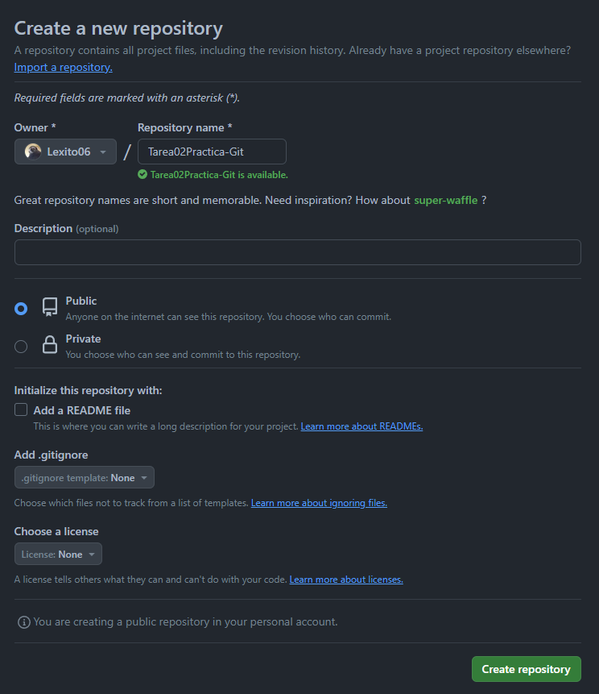
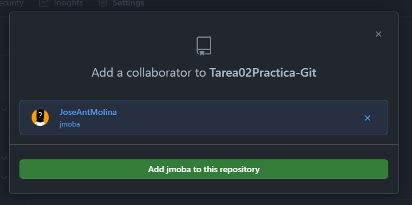

# Tarea 2, Práctica Git

## Dalian Stetcu Stepanov
## Lenguajes de marcas y sistemas de gestión de información
## IES Aguadulce
## 1º D.A.W
## (Enlace mas tarde)

### Creación del repositorio en nuestro ordenador (init)

Creco el repositorio git en la mi carpeta "Tarea02Practiga-Git" mediante el comando git init
```
maniana@DAMDAW1-XX MINGW64 ~/Desktop/Tarea02Practica-Git
$ git init
Initialized empty Git repository in C:/Users/maniana/Desktop/Tarea02Practica-Git/.git/
```

### Creación de un commit inicial (add, status, commit, log)

A continuación hago el primer commit
```
maniana@DAMDAW1-XX MINGW64 ~/Desktop/Tarea02Practica-Git (master)
$ git add .

maniana@DAMDAW1-XX MINGW64 ~/Desktop/Tarea02Practica-Git (master)
$ git status
On branch master

No commits yet

Changes to be committed:
  (use "git rm --cached <file>..." to unstage)
        new file:   README.md
        new file:   capturas/creacion_readme.png


maniana@DAMDAW1-XX MINGW64 ~/Desktop/Tarea02Practica-Git (master)
$ git commit -m "añado documentacion"
[master (root-commit) c9d51aa] añado documentacion
 2 files changed, 40 insertions(+)
 create mode 100644 README.md
 create mode 100644 capturas/creacion_readme.png

maniana@DAMDAW1-XX MINGW64 ~/Desktop/Tarea02Practica-Git (master)
$ git log
commit c9d51aa242590d8df446e0b4d7e27969826b7cf9 (HEAD -> master)
Author: repaso <repaso@lmsgi.edu>
Date:   Mon Jan 15 08:43:14 2024 +0100

    añado documentacion
```
### Creación del repositorio en Github

Accedo a GitHub y creo el repositorio y añado al profesor





### Añadir el remoto al repositorio local (branch, remote)

Añado el remoto mediante los comandos "git remote add origin", "git remote -v" y "git branch -v"
```
maniana@DAMDAW1-XX MINGW64 ~/Desktop/Tarea02Practica-Git (master)
$ git remote add origin https://github.com/Lexito06/Tarea02Practica-Git.git

maniana@DAMDAW1-XX MINGW64 ~/Desktop/Tarea02Practica-Git (master)
$ git remote -v
origin  https://github.com/Lexito06/Tarea02Practica-Git.git (fetch)
origin  https://github.com/Lexito06/Tarea02Practica-Git.git (push)

maniana@DAMDAW1-XX MINGW64 ~/Desktop/Tarea02Practica-Git (master)
$ git branch -v
* master c9d51aa añado documentacion
```
### Subir el repositorio a Github (push)
```

```
### Comprobar que está subido a Github
```

```
