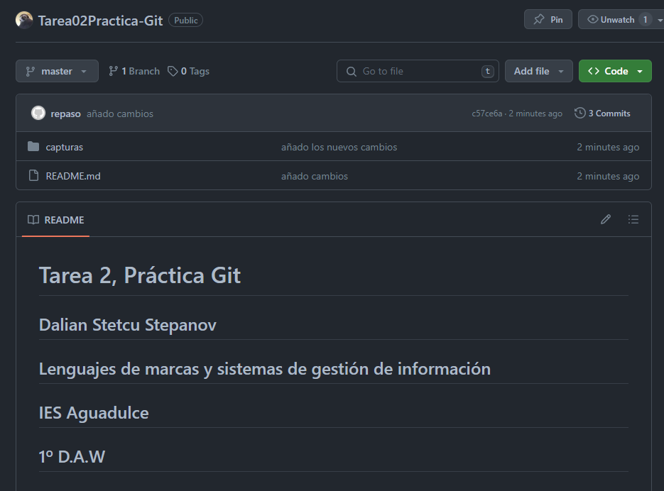
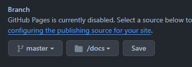
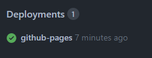
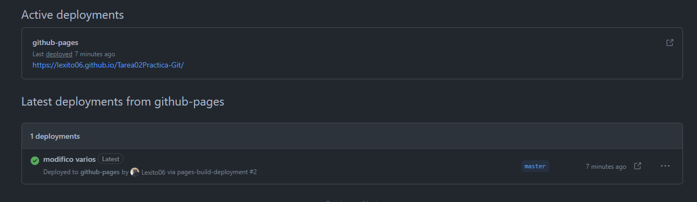
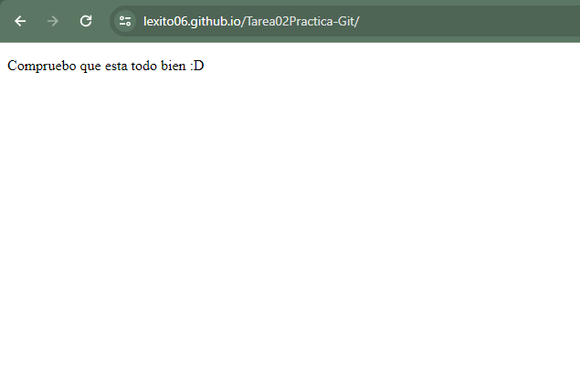

# Tarea 2, Práctica Git

## Dalian Stetcu Stepanov
## Lenguajes de marcas y sistemas de gestión de información
## IES Aguadulce
## 1º D.A.W
## https://lexito06.github.io/Tarea02Practica-Git/

### Creación del repositorio en nuestro ordenador (init)

Creo el repositorio git en la mi carpeta **Tarea02Practiga-Git** mediante el comando **git init**
```
maniana@DAMDAW1-XX MINGW64 ~/Desktop/Tarea02Practica-Git
$ git init
Initialized empty Git repository in C:/Users/maniana/Desktop/Tarea02Practica-Git/.git/
```

### Creación de un commit inicial (add, status, commit, log)

A continuación añado todo con el comando **git add** y hago el commit con el comando **git commit**. Por otra parte uso el **git status** para comprobar que el commit se haya realizado correctamente y hago el **git log** para comprobar el historial de mis commits utilizados (en este caso no he usado el comando **git log --oneline** debido a que el log no es muy grande, pero dicho comando es muy util a partir del segundo "commit" utilizado)
```
maniana@DAMDAW1-XX MINGW64 ~/Desktop/Tarea02Practica-Git (master)
$ git add .

maniana@DAMDAW1-XX MINGW64 ~/Desktop/Tarea02Practica-Git (master)
$ git status
On branch master

No commits yet

Changes to be committed:
  (use "git rm --cached <file>..." to unstage)
        new file:   README.md
        new file:   capturas/creacion_readme.png


maniana@DAMDAW1-XX MINGW64 ~/Desktop/Tarea02Practica-Git (master)
$ git commit -m "añado documentacion"
[master (root-commit) c9d51aa] añado documentacion
 2 files changed, 40 insertions(+)
 create mode 100644 README.md
 create mode 100644 capturas/creacion_readme.png

maniana@DAMDAW1-XX MINGW64 ~/Desktop/Tarea02Practica-Git (master)
$ git log
commit c9d51aa242590d8df446e0b4d7e27969826b7cf9 (HEAD -> master)
Author: repaso <repaso@lmsgi.edu>
Date:   Mon Jan 15 08:43:14 2024 +0100

    añado documentacion
```

Esta primera vez he añadido y usado el commit en los archivos mediante la consola pero a partir de ahora uso la herramienta de **visual studio code** para añadir los archivos nuevos, usar el commit y subirlos. Esta herramienta se situa en el icono arriba a la izquierda llamado "control de código".

### Creación del repositorio en Github

Accedo a mi página de **GitHub** y creo el repositorio añadiendo al profesor como colaborador


### Añadir el remoto al repositorio local (branch, remote)

Añado el remoto mediante el comando **git remote**, compruebo que el repositorio esta enlazado correctamente con el comando **git remote -v** y compruebo mi rama master con el comando **git branch -v**
```
maniana@DAMDAW1-XX MINGW64 ~/Desktop/Tarea02Practica-Git (master)
$ git remote add origin https://github.com/Lexito06/Tarea02Practica-Git.git

maniana@DAMDAW1-XX MINGW64 ~/Desktop/Tarea02Practica-Git (master)
$ git remote -v
origin  https://github.com/Lexito06/Tarea02Practica-Git.git (fetch)
origin  https://github.com/Lexito06/Tarea02Practica-Git.git (push)

maniana@DAMDAW1-XX MINGW64 ~/Desktop/Tarea02Practica-Git (master)
$ git branch -v
* master c9d51aa añado documentacion
```
### Subir el repositorio a Github (push)

Primero hago añado todos los cambios con el comando **git add** y hago el **git commit** para despues subirlo el repositorio a GitHub haciendo el comando **git push**

```
maniana@DAMDAW1-XX MINGW64 ~/Desktop/Tarea02Practica-Git (master)
$ git push origin master
Enumerating objects: 14, done.
Counting objects: 100% (14/14), done.
Delta compression using up to 12 threads
Compressing objects: 100% (13/13), done.
Writing objects: 100% (14/14), 106.26 KiB | 15.18 MiB/s, done.
Total 14 (delta 2), reused 0 (delta 0), pack-reused 0
remote: Resolving deltas: 100% (2/2), done.
To https://github.com/Lexito06/Tarea02Practica-Git.git
 * [new branch]      master -> master
```
### Comprobar que está subido a Github

Compruebo que todo esta subido correctamente a mi repositorio de GitHub



## Publicación en Github Pages

Antes de comenzar con la publicación en **Github Pages**, creo mi carpeta **docs** y dentro creo el archivo index.html (añadiendole algo de contenido para comprobar que la publicación es correcta)

### Configurar el repositorio para que publique el directorio raíz en Github Pages.

Entro en Github y configuro el repositorio para publicar la carpeta **docs** en Github pages



### Mostrar los despliegues (deployments).

A continuación muestro los despliegues comprobando que esta subido correctamente a Github Pages





### Mostrar la página web.

Muestro la página web para comprobar que el enlace funciona



## Uso de Git mediante la interfaz de VSCode:
### Creación de otro commit

Realizo un commit mas mediante la herramienta de Visual Studio Code que se encuentra arriba a la izquierda llamada **control de código**, añadiendo los cambios hechos con el boton **+** y confirmando

### Subir el repositorio a Github


### Comprobar que está subido a Github

### Ver el listado de commit desde Github

